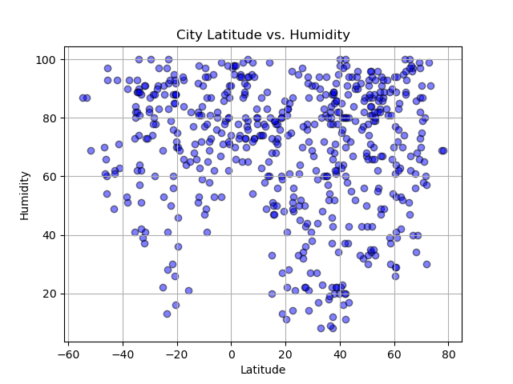
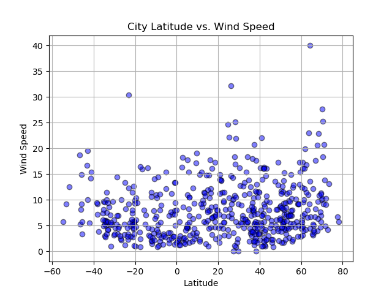
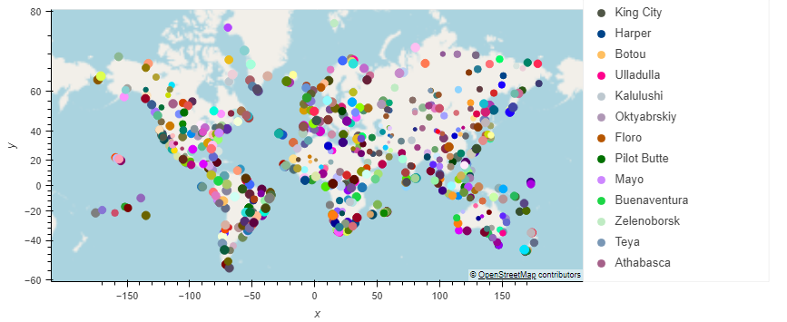

# Module 6 Challenge: Python API
<ins>Project Overview</ins>
-----

This challenge asked me to use the starter code for WeatherPy and VacationPy and gather certain outputs from two different API calls. Below are some of the outputs called from the WeatherPy code

For WeatherPy I used the OpenWeatherMap API key to call the information I needed and the Geoapify key for VacationPy. For WeatherPy, I generated a cities list using the citypy library and created plots to show the relationship between different weather variables and latitude. (See the scatter plots & map above) I exported this list into a csv for later use.

For VacationPy, I loaded in the csv that I had created in the first part of the project to a map that showed the size of the point as the humidity in each city. I narrowed down the cities to fit my parameters of temperature between 70-90 degrees and less than 50% humidity. Lastly, I searched for a hotel in each city and mapped them with hover text to give information about the location.

<ins>Credits<ins>
  

In working on this challenge, I consulted with my bootcamp friends as well as the documentation online for the hvplot, matplotlib and scipy.stats
